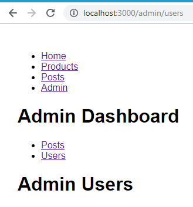

# React Simple Routing

## About example:

Route Paramters, Query String, Redirect, Not Found (404) Pages, Nested Routing 

Routing and navigation. Example route parameters and query string. Example redirect users and implement not found pages, as well as nested routing.
`<BrowserRouter>` component wraps the history object in browsers and pases it down to component tree. So anywhere in our component tree, we'll be able to use the history object. 
For register our route we use component `<Route path="/" exact component={home} />`. The matching algorithm that the route component uses checks to see if the current url starts with defined path. If so, then, this component will be rendered. And that basically means we need to tell React what components should be rendered based on a given url. The `<Switch>` component will render the first trial that matches the location, with switch we no longer need defined exact atribute for route component. 
So if the path matches, the pattern we have set here it will render this component, and it will automatically inject these three props into it.
 
So we use history to work to the object in the browser, and with that we can send the user to a different page. We also have location which represents where the app is now.
`Route Props` - So essentially a route component is a wrapper around this component that we defined for atribute `component={}` 
When the user navigates from one page to another, instead of reloading the entire page with all it's assets we should only update what we have in the content area. So how can we fix this issue? We can use the `<Link to="/">Home</Link>`, component of react router DOM, this component has atribut `to` where we define redirect path. When I click on the `<Link to="/">Home</Link>` component, we are not going o see new requests on the product tab, and there was no additional request to this server. Because the content for these components are essentially in our bundle.js. Components are part of our bundle, they are downloaded ahead of time when the application loads. So there's no need to re download this bundle every time the user navigates to a different page. 
The `<Link to="/">Home</Link>` has a handler for the onClick event, that's a prop, like this `onClick: fn()`. When we click these links, this handler is called and this function prevents the default behavior of an anchor, so that's why the browser will not send additional requests to the server, instead, this handler will only update the url, after changed url one of defined routes will match depending on the current url, and we'll get a new component in the DOM. 
With `<Redirect to="/not-found" />` component, we can redirect the user to a different url. If we defined component `<Route path="/not-found" component={NotFound} />` before `<Route path="/" exact component={Home} />` and if we change the url to an invalid url, we get an automatically redirected and we see NotFound component. 
Sometimes you want to move resources from your website from one url to another one. You can use the `<Redirect from="" to="" />` component to achieve this. So here is an example `<Redirect from="/messages" to="/posts" />` 
If we need select parameters from url example like this `http://localhost:3000/posts/2018/05?sortBy=newest&approved=true`, we can select `sortBy=newest&approved=true` with `queryString.parse(location.search)`. it will return this `{approved: "true", sortBy: "newest"}` 

[More about react router documentation](https://reacttraining.com/react-router/core/api/contextrouter) 

### Content:

index:

- [./src/index.js](./src/index.js)

App:

- [./src/App.jsx](./src/App.jsx)

components/:

- [./src/components/home.jsx](./src/components/home.jsx)
- [./src/components/navbar.jsx](./src/components/navbar.jsx)
- [./src/components/notFound.jsx](./src/components/notFound.jsx)
- [./src/components/posts.jsx](./src/components/posts.jsx)
- [./src/components/productDetails.jsx](./src/components/productDetails.jsx)
- [./src/components/products.jsx](./src/components/products.jsx)

  components/admin:

- [./src/components/admin/dashboard.jsx](./src/components/admin/dashboard.jsx)
- [./src/components/admin/posts.jsx](./src/components/admin/posts.jsx)
- [./src/components/admin/sidebar.jsx](./src/components/admin/sidebar.jsx)
- [./src/components/admin/users.jsx](./src/components/admin/users.jsx)

## Project screenshot:

This project was bootstrapped with [Create React App](https://github.com/facebook/create-react-app). 

## Available Scripts

In the project directory, you can run:

### `npm start`

Runs the app in the development mode. 
Open [http://localhost:3000](http://localhost:3000) to view it in the browser.

The page will reload if you make edits. 
You will also see any lint errors in the console.

### `npm test`

Launches the test runner in the interactive watch mode. 
See the section about [running tests](https://facebook.github.io/create-react-app/docs/running-tests) for more information.

### `npm run build`

Builds the app for production to the `build` folder. 
It correctly bundles React in production mode and optimizes the build for the best performance.

The build is minified and the filenames include the hashes. 
Your app is ready to be deployed!

See the section about [deployment](https://facebook.github.io/create-react-app/docs/deployment) for more information.

### `npm run eject`

**Note: this is a one-way operation. Once you `eject`, you can’t go back!**

If you aren’t satisfied with the build tool and configuration choices, you can `eject` at any time. This command will remove the single build dependency from your project.

Instead, it will copy all the configuration files and the transitive dependencies (Webpack, Babel, ESLint, etc) right into your project so you have full control over them. All of the commands except `eject` will still work, but they will point to the copied scripts so you can tweak them. At this point you’re on your own.

You don’t have to ever use `eject`. The curated feature set is suitable for small and middle deployments, and you shouldn’t feel obligated to use this feature. However we understand that this tool wouldn’t be useful if you couldn’t customize it when you are ready for it.

## Learn More

You can learn more in the [Create React App documentation](https://facebook.github.io/create-react-app/docs/getting-started).

To learn React, check out the [React documentation](https://reactjs.org/).
